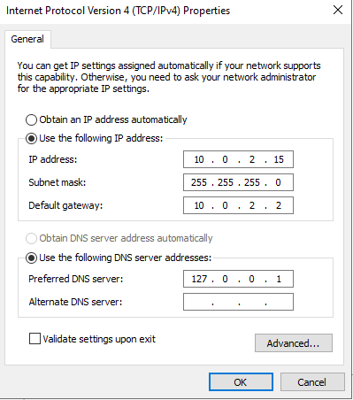
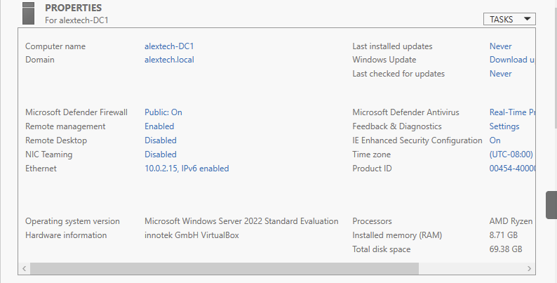
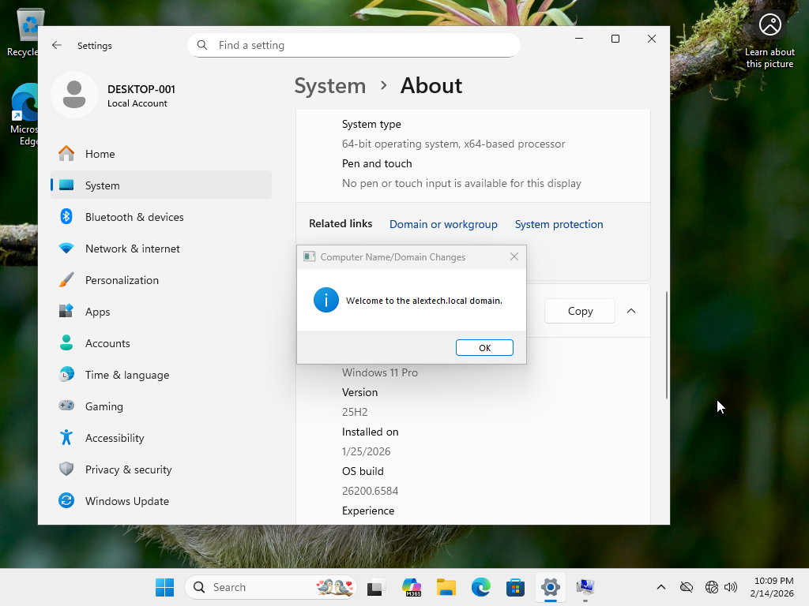
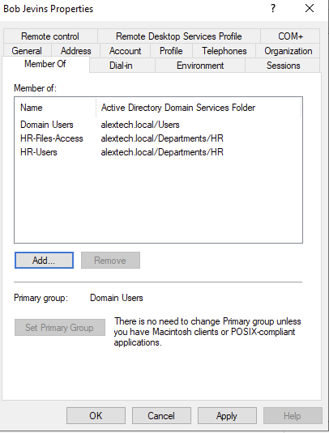
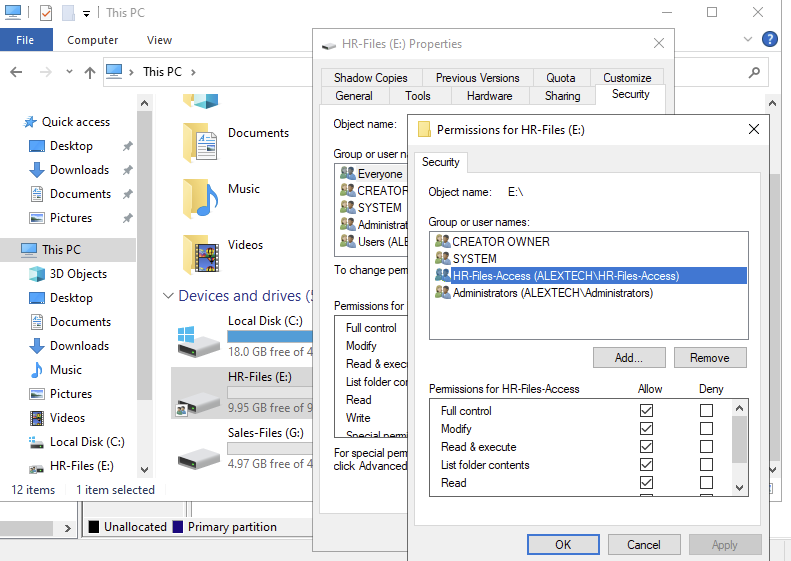
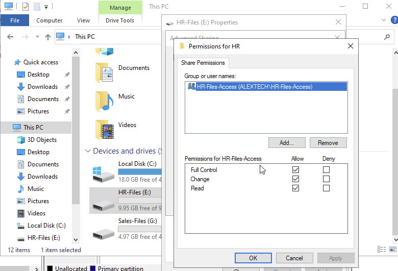
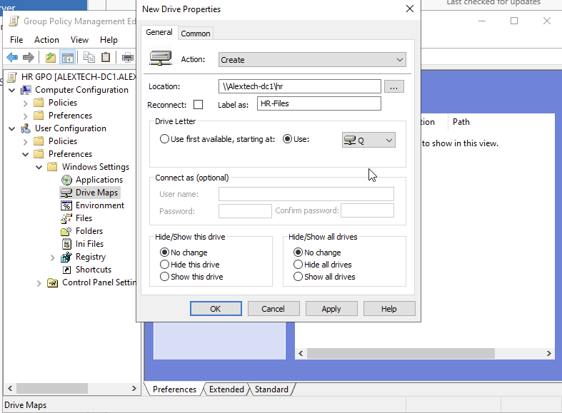
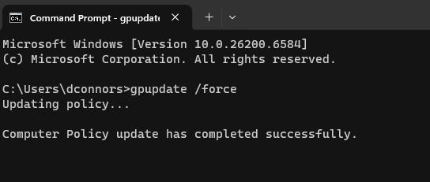
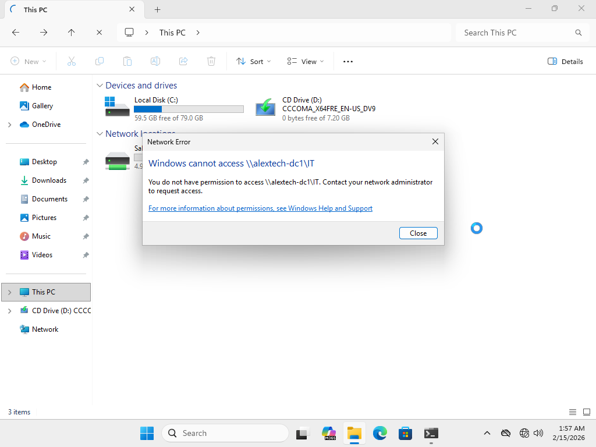
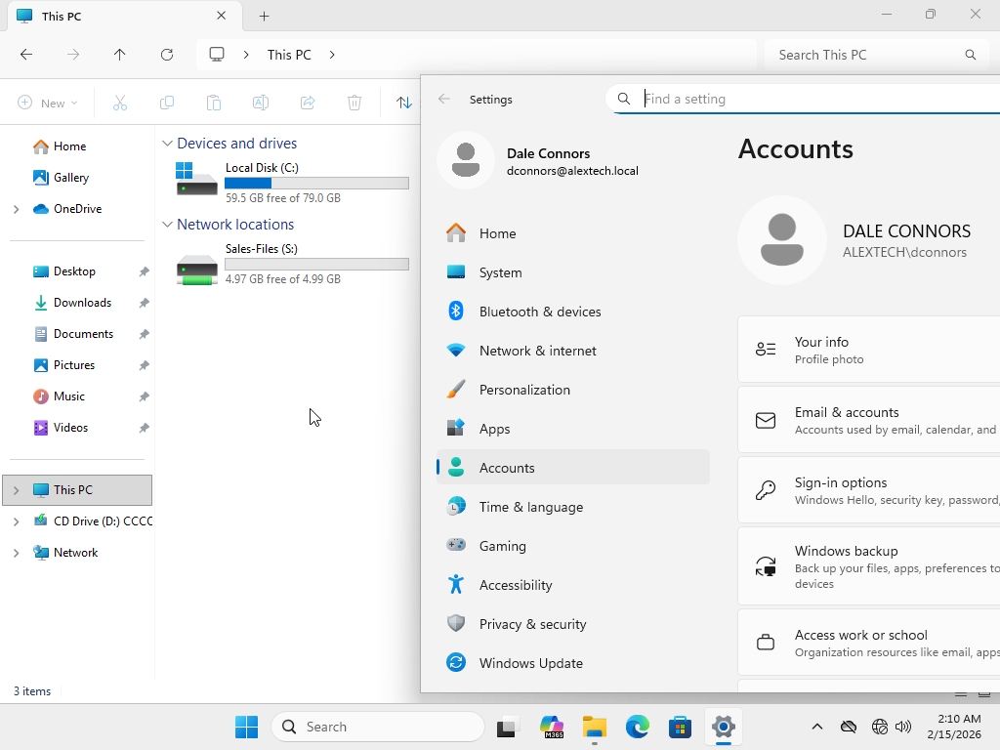

# Active Directory Lab - Step by Step

## 1. Lab Setup

- Installed Windows Server 2022 and Windows 11 Pro using VirtualBox to simulate a server and client computer.
- Installed Active Directory Domain Services and promoted Windows server to a domain controller with the domain "alextech.local"
- Configured static TCP/IP settings on server and client:
  - Server DNS points to itself (ensures AD services are always reachable)
  - Client DNS points to server IP
- Windows client joined to the domain "alextech.local".

---

## 2. Organizational Units & Users

- Created the Organization Unit "Departments" with Child Organizational Units for each department: HR, Sales, IT.
- Onboarded employees to their respective department.
- Users forced to change password at next logon.
- Restricted login hours (Ex. 8:00PM - 5:00PM, Monday to Friday)
- Configured account lockout policy under Default Domain Policy.
  

---

## 3. Groups & Permissions

- Created department user groups ("HR-Users", "IT-Users", "Sales-Users") and files-access groups ("HR-Files-Access", "IT-Files-Access", "Sales-Files-Access")
- Added users to their correct groups
- User groups added to respective Files-Access groups (simplifies permission management).
  

---

## 4. Department Drives

- Created drives for each department.
- Removed "everyone" from permissions.
- Implementing least privilege: employees only have access to their department drive.
- NTFS/Share permissions configured:
  - Ex. "E:\HR-Files", "HR-Users" -> Allow Full Control
    

----

## 5. Group Policy for Drive Mapping

- Created GPO for each department to map drives.
- On client machine:
  - Run gpupdate /force in the Powershell to apply changes.
  - Run gpresult /r to verify the correct GPO linkage.
- Correct drive now populates in File Explorer.
- Other department drives are not visible in File Explorer.
- Manual attempts to access other drives by typing in \\ServerName\Drive result in "Network Error".
  

---

## 6. Verification

- Account lockout policy verified and working.
- Drive mapping and permissions confirmed.
  

